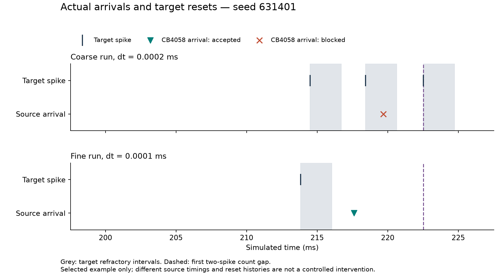

# CB4058 arrivals and target resets — 10 October 2026

Actual saved histories support a specific candidate explanation for selected count differences: an inhibitory arrival can be retained in one target history but blocked or cleared in the other. This is not a controlled demonstration that this source initiates the numerical divergence. Both its arrival timing and the target's reset history already differ.

## All selected cases, including contrary cases

After CB4058 (720575940643867296) appeared prominently in the source decomposition, recorded a follow-up restricted to the same 26 targets and their already fixed comparison times. Kept the four absent seeds. Counted all actual source arrivals before each state and classified the latest arrival relative to the target's saved reset/refractory history. No event pairing or manufactured history was used.

| Latest CB4058 arrival before state | Leading run | Other run |
|---|---:|---:|
| Retained since last reset | 6 | 19 |
| Blocked during refractoriness | 4 | 0 |
| Cleared by a later target reset | 10 | 1 |
| No arrival in this target prefix | 6 | 6 |

“Retained” means accepted after the latest reset, not that its entire original jump remains at the comparison time; its drive decays and contributes through the membrane response. “Cleared” does not claim that it was accepted before the reset. The six no-arrival cases are not evidence that the source never connects or fires elsewhere.

The source's reconstructed voltage contribution is more negative in the other run in 17 cases, equal in seven, and more negative in the leading run in two. Its total incoming-event count before comparison is equal across runs in 18/26 cases. These facts rule out a simple universal story of “more source spikes causes less target firing.” They do not by themselves identify which changed event causes each gap. The source and targets were selected after prior results, and repeated target cells prevent treating these as independent demonstrations.

## Smallest-seed illustration

Chose the smallest previously selected seed (631401) before plotting, without selecting a new maximum effect. The target is 720575940630868793. At its first two-spike gap, 222.5294 ms:

- In the coarse run, the latest target reset was at 218.4392 ms. The CB4058 arrival at 219.6968 ms falls inside the refractory interval ending at 220.6392 ms and is blocked.
- In the fine run, the latest target reset was at 213.8407 ms. The CB4058 arrival at 217.6196 ms occurs after release at 216.0407 ms and is accepted. Its reconstructed voltage contribution at comparison is −28.2941 mV.
- Each history has eleven CB4058 arrivals before comparison. This equal count does not make the event histories or target states otherwise identical.

The plot uses actual target spikes and actual delayed source arrivals, with inferred refractory intervals from the model. Grey regions denote target refractoriness, not a measured voltage trace. It shows an acceptance difference between actual histories without asserting that the two latest arrivals are the same physical spike or that this difference alone causes the extra target spikes. Other incoming sources and earlier resets also contribute.

## Checks and meaning for the meeting

All 52 history classifications and counts match an independent direct event/reset-interval loop. Every source voltage contribution matches the previously independently verified source decomposition. The figure was visually reviewed for event placement, label readability and caveats. Complete event tables and source records remain available; no favorable cases replaced the full table.

Full outputs: results/pcdr/cb4058_history_20261010 and results/pcdr/cb4058_timeline_20261010. [Compact evidence](evidence/2026-10-10/cb4058_history/snapshot.json) preserves protocols, all cases, verification and the figure. Scripts: `pcdr_cb4058_history.py --out <unused-directory>` and dated `pcdr_cb4058_plot.py` (refuses its existing output directory).

This is a concrete hypothesis to discuss with advisers: resolution-dependent recurrent timing interacts with reset/refractory history to alter accepted inhibition. It is not a validated initiating mechanism or evidence of eigencircuit specificity. An earlier target spike can itself clear or block inhibition, so association can reflect feedback rather than a one-way cause. Do not launch a source lesion or claim deleting this source would restore convergence based on this result.

All eighteen original full convergence groups remain failed. No network simulation, CCR launch or upload occurred. Code, analysis, plot and verification used Codex assistance.
