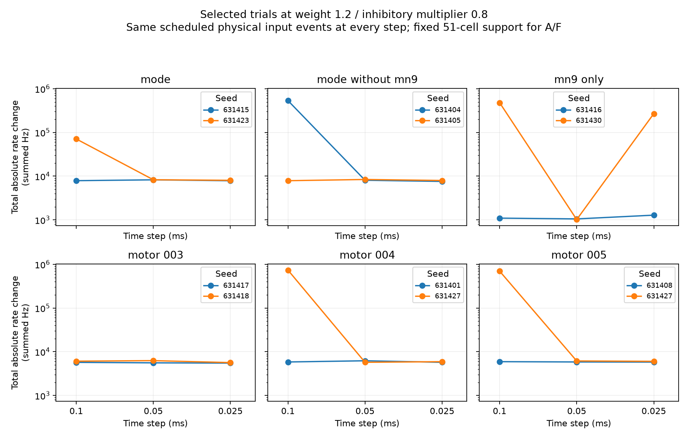
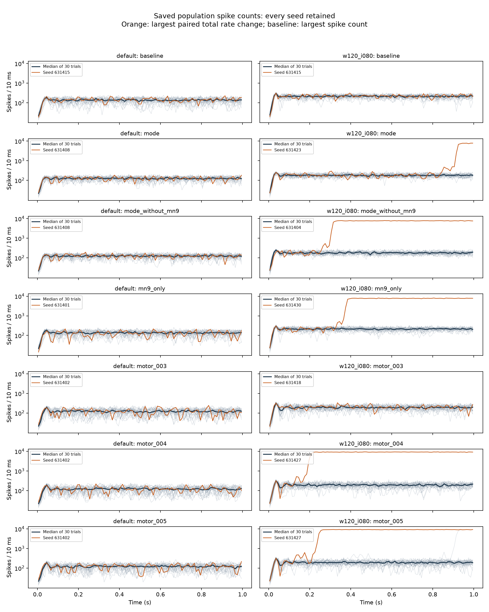
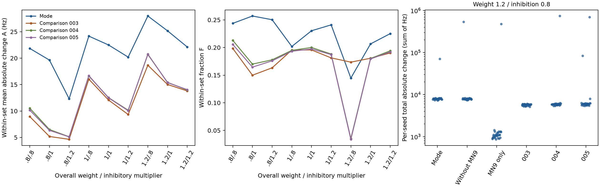

# CCR run, 27 September 2026

## Recorded replay completed locally, 28 September

The four planned one-second runs completed from 23:10:35 to 23:21:25 EDT, about 10 minutes 50 seconds. The UTC dates in manifests are 29 September. The plan, ten selected recording cells and original simulator files were unchanged. Memory available at startup was 7.073 GB, exceeding the existing 6 GB requirement; one worker ran at a time. All four matched the complete ordered saved spike sequences and delivered events exactly.

| Time step (ms) | Baseline spikes | Mode-without-MN9 spikes |
| --- | ---: | ---: |
| 0.0125 | 21193 | 629557 |
| 0.00625 | 21380 | 17959 |

These are total spike counts, not the paired total-absolute-rate endpoint. The large response at 0.0125 ms and the smaller response at 0.00625 ms both survive the added recording. This establishes that the new recorder preserves those event outputs in these four cases; it does not establish time-step convergence or identify why the trajectories separate.

A separate local checker revalidated file hashes, reference identities, exact events, recorded indices, array dimensions, finite values and physical sampling times. For every selected neuron it reconstructed spike ticks from the before-threshold voltage (> -45 mV) and refractory-eligibility flag; these matched its saved spikes at both steps in both conditions. Each of two recording slots contains 80000 samples per cell at 0.0125 ms or 160000 at 0.00625 ms. Actual schedules are saved with the trials. Measured worker peak RSS ranged from 2.744 to 2.883 GB. Full traces stay under results/pcdr/observed_replay_20260928; the compact verification record is evidence/2026-09-28/observed_replay_check.json.

For selected neuron 720575940612611301, the first exact stored synaptic-drive difference between lesion and baseline is at 12.5625 ms with the 0.0125 ms step, followed by a voltage difference at 12.575 ms. At 0.00625 ms these times are 12.55625 and 12.5625 ms. These comparisons use exact stored floats, without a physiological tolerance. They describe early effects of the lesion in selected cells; they do not attribute the later population increase to that neuron or that first difference. The ten cells were selected from known spike differences, not independently of outcomes.

The next analysis can use these saved states locally to examine the period between early differences and later population growth. No further simulation is needed merely to inspect them. Evidence is still limited to ten selected cells and this one seed/lesion case. A claim about a particular recurrent pathway would need additional structural and temporal evidence and a separately specified intervention.

## Local event and comparator review

Reviewed all 12 previously selected high-weight lesion/seed pairs at all five steps (60 pairs), retaining every case. Rechecked hashes for each input table read. Compared exact neuron/time events on the common 0.00625 ms grid and retained all 100 population bins per trial. Evidence: evidence/2026-09-27/event_review/. No simulations or comparison-set changes were made.

The following times describe selected trajectories, not a biological onset definition. The cumulative-excess crossing was set at 1000 additional spikes for this review before calculating the table; it is measured only at 10 ms bin ends and is not a convergence, exclusion or significance criterion.

| Lesion/seed/step | First spike-event difference (ms) | First bin end with 1000 cumulative excess spikes (ms) | Peak excess bin start (ms) |
| --- | ---: | ---: | ---: |
| MN9 alone, 631430, 0.1 ms | 26.5 | 370 | 530 |
| MN9 alone, 631430, 0.025 ms | 25.975 | 620 | 810 |
| Mode without MN9, 631405, 0.0125 ms | 13.2125 | 200 | 760 |

The first event difference occurs long before the large increase in population activity. First difference includes a shifted spike time as well as an added or missing spike; it does not identify a causal neuron. All seven inspected trajectories with more than 50000 lesion spikes have identical delivered external-event records to their same-step baselines. The only delivered-event difference among the 60 pairs occurs in comparison 004, seed 631401, at 0.1 ms, starting at 856 ms; that lesion has 18423 spikes versus 20768 in its baseline. Thus changed delivered input is not an explanation for the seven large trajectories. Equality within a pair does not assert equality across different time steps. Saved spikes and input jumps do not expose membrane voltage or recurrent drive, so these observations cannot determine the mechanism of divergence.

Recomputed baseline rates and any-spike recruitment from all 30 default baselines at each of 0.1, 0.05 and 0.025 ms. Static anatomy and model-sign features are unchanged. The mode and each fixed comparator have 29 recruited cells at the two coarser steps. At 0.025 ms the mode has 30, while each comparator still has 29: neuron 720575940620301588 emits one spike in one baseline, giving a mean of 0.03333 Hz. This illustrates the sensitivity of an any-spike category. It does not justify silently replacing the original recruitment rule or changing active29 membership. Exact sign/recruitment/motor strata no longer match at that step, even though baseline-rate pooled SMDs remain below 0.1 (0.07397–0.08847).

The three comparisons also retain incoming-degree variance ratios of 13.00–13.09 on the log1p scale and ECDF gaps of 0.27451. Similar means therefore remain insufficient evidence of similar feature distributions. [Austin (2009)](https://doi.org/10.1002/sim.3697) supports examining distributional spread and higher moments alongside standardized mean differences; its observational-data setting does not provide a fly-model acceptance threshold.

The eligible pool itself constrains diversity. At every tested step, the target requires eight recruited excitatory motor cells, and only eight eligible alternatives exist after excluding the target and sugar inputs. All eight must therefore be shared by any set satisfying these strata. Three recruited inhibitory motor cells are required from four alternatives, giving only four possible active motor memberships under these constraints. This is a necessary combinatorial limitation, not a solution of simultaneous degree/strength/distribution matching. More optimized sets would not produce many independent motor alternatives.

Next decision: keep the existing comparisons descriptive and retain the original membership records. Do not launch a larger batch of nominally matched sets yet. A defensible prospective design needs an explicit choice between conditional comparisons with forced motor overlap, a question limited to nonmotor members, or additional modes and input conditions. Each changes the scope and needs a recorded selection rule before new outcomes. For numerical diagnosis, a small targeted follow-up should first reproduce the mode-without-MN9 seed 631405 at 0.0125 and 0.00625 ms with paired baselines, then record voltage, recurrent drive and scheduling information for a prespecified set of cells. Recording must first be shown not to alter spikes. The current evidence does not justify declaring a dynamical transition or choosing a preferred step from response size.

## Completed 530-trial time-step comparison

The next run completed on CCR from 22:01:05 to 23:07:35 UTC on 27 September, about 66.5 minutes with 16 workers. The downloaded ZIP contains the full trial records. Local checks reproduced all 530 trial summaries, 444 paired rows and 26 mean rows. All four exact replays matched ordered spikes and delivered events. Checks included the frozen plan and sources, output hashes, process completion, original input schedules, delivered-event membership, neuron IDs, spike counts, time grids, refractory spacing and population traces. Evidence and archive hash are in evidence/2026-09-27/resolution/. The original files remain unchanged.

At default, the full-mode averages remain close across the three tested steps:

| Step (ms) | A (Hz) | F | Total absolute mean response (summed Hz) |
| --- | ---: | ---: | ---: |
| 0.1 | 22.50327 | 0.230290 | 4983.57 |
| 0.05 | 22.28235 | 0.230280 | 4934.87 |
| 0.025 | 22.30915 | 0.230822 | 4929.20 |

These use 30 paired seeds and the full 51-cell support. Signed responses are averaged across seeds before absolute values are taken. At both new steps, full-mode A and F exceed all three previously selected comparators. This ordering is descriptive: it does not repair their matching limitations or introduce independent modes, flies or input conditions.

Similar aggregate values do not imply identical affected neurons. Between 0.05 and 0.025 ms, the absolute difference between full-mode mean response vectors is 162.87 summed Hz, 3.30% of the latter response. Corresponding differences for the three comparators are 5.02–6.69%. MN9-only is a different case: its mean vector changes by 184.57 summed Hz, 112.18% of its small 0.025 ms response. Its own-support A changes from 1.10 to 0.06667 Hz. Do not extend the full-mode average stability to every condition or trajectory. No convergence tolerance was specified before observing these results.

Active29 remains close on the common 51-cell support: A/F are 22.24510/0.230426 at 0.05 ms and 22.10131/0.231315 at 0.025 ms. Its own 29-cell-support A values are 38.93218 and 38.68046 Hz; those must not be compared directly with full-mode A on 51 cells. Membership was fixed using the original baselines and these same seeds, so this remains a retrospective comparison.

At weight 1.2/inhibitory multiplier 0.8, the additional steps reveal another non-monotonic response. Paired total absolute rate changes for two instructive selected cases are:

| Lesion and seed | 0.1 ms | 0.05 ms | 0.025 ms | 0.0125 ms | 0.00625 ms |
| --- | ---: | ---: | ---: | ---: | ---: |
| MN9 alone, 631430 | 479264 | 1018 | 269342 | 1035 | 1237 |
| Mode without MN9, 631405 | 7882 | 8397 | 7968 | 622302 | 7919 |

The second case was the previously selected near-median example. At 0.0125 ms its lesion produces 629557 spikes and recruits 11989 non-input cells. This is retained, not discarded as an outlier. The MN9-only response is much smaller at the two newest steps, but a different lesion becomes large at an intermediate step. These observations rule out a simple claim that each successive smaller step consistently removes the large responses. Neither selecting the smallest result nor pooling time steps as replicate trials is justified.

The saved schedules preserve physical external-event times; state-dependent delivered jumps can still differ. Brian2 documents that spike timing and propagation remain tied to the network clock even when subthreshold equations are integrated exactly. That provides a reason to examine threshold, delay and refractory timing, not a diagnosis of this particular response. See [Brian2 2.9.0 integration documentation](https://brian2.readthedocs.io/en/2.9.0/user/numerical_integration.html) and [clock and scheduling documentation](https://brian2.readthedocs.io/en/2.9.0/user/running.html).

Next work should separate two questions. For the default-setting claim, inspect baseline-only comparator balance and recruitment at the finer step before deciding whether a defensible new comparison is feasible; freeze any new selection and use unused seeds for its later test. For the high-weight cases, first use the downloaded population and delivered-event records to locate when paired trajectories separate. A later targeted simulation should record the relevant voltage/current and scheduling behavior, with comparisons fixed before execution. Another broad grid is not yet justified. Numerical robustness at default is more supported than before, but independent eigencircuit-specific prediction and high-weight numerical convergence remain unresolved.

## Earlier 101-trial follow-up: replay, time steps and active cells

The 101-trial follow-up completed on CCR between 20:52:19 and 21:00:28 UTC, about eight minutes, using 16 workers. Downloaded the results ZIP, full trial archive and controller log. Independently checked all 101 trials locally: source and output hashes, source-trial identity, process completion, neuron IDs, sparse rate counts against full spikes, population traces, input schedules, delivered-event membership, time grids and refractory spacing. Recalculated all reported trial rows, all 36 paired time-step rows and the active-29 summary. All 25 replays match the original ordered spikes and delivered inputs exactly, including the cases with large responses. Reproducibility at one time step is therefore established for those selected replays; convergence across steps is not.

The time-step tests retain the same scheduled physical input events. These are selected large-response and near-median trials at weight 1.2/inhibitory multiplier 0.8, not a new sample of all input seeds. Paired total absolute rate changes are:

| Lesion and seed | 0.1 ms | 0.05 ms | 0.025 ms |
| --- | ---: | ---: | ---: |
| Mode, 631423 | 70,958 | 8,282 | 8,036 |
| Mode without MN9, 631404 | 535,544 | 8,066 | 7,585 |
| MN9 alone, 631430 | 479,264 | 1,018 | 269,342 |
| Comparison 004, 631427 | 737,966 | 5,738 | 5,935 |
| Comparison 005, 631427 | 697,625 | 6,157 | 6,037 |

Values are summed Hz over the full neuron universe after pairing each lesion with its baseline at the same step. The five displayed rows are the large-response cases selected in advance of this follow-up. All 12 selected lesion/seed combinations, including the near-median cases and comparison 003, are retained in checked_step_pairs.csv and the figure. The new time-step A/F values use a common fixed 51-cell support; they should not be substituted for historical single-cell or comparator-own-support A/F values.

Four of the five displayed responses become much smaller at both finer steps. MN9-only seed 631430 is different: its lesion spike count is 492,991, 21,270 and 286,773 at the three steps, with 11,948, 499 and 11,818 recruited non-input cells. The large response at 0.025 ms occurs mainly in the second half of the trial. It is not valid to say that all large responses disappear as the step decreases or that 0.025 ms is converged. These results demonstrate step sensitivity in the selected trajectories. They do not yet establish a physiological mechanism, a dynamical transition or which result best approximates the continuous-time model.

At default, lesioning the 29 cells active in at least one original baseline produces a mean response close to, but different from, the full 51-cell lesion. On the same fixed 51-cell support, A is 22.68105 versus 22.50327 Hz and F is 0.231308 versus 0.230290. MN9 changes by -82.3333 versus -82.4667 Hz. The absolute sum of the difference between the mean response vectors is 79 summed Hz, or 1.5852% of the full-mode response; their signed cosine is 0.999896. This is a descriptive comparison at the original 0.1 ms default setting, not proof of equivalence at other inputs or steps.

Retrospective paired seed-bootstrap intervals for active29 minus full51 are A = 0.17778 [0.02092, 0.33529] Hz and F = 0.001018 [0.000086, 0.002033], using 2,000 resamples with seed 630727 and the same row weights for both conditions. These small differences and their conditional intervals do not establish a minimum biological effect or an equivalence margin. The cells were selected using these same default baselines; no held-out claim is made. Comparator imbalance remains unresolved.

The next numerical check should examine the remaining inconsistent MN9-only case and paired baselines at 0.0125 and 0.00625 ms, retaining ordinary comparison trials. Separately, default-setting mode and comparator conclusions need a time-step check; the current finer-step tests cover only the high-weight/low-inhibition setting. Do not replace the full grid's results with this selected subset or discard the 0.1 ms seeds after seeing their finer-step behavior. A larger reference-set experiment should wait until the time-step choice and comparison design have been justified. No further CCR simulations were launched during this local review.

## Local checks of the downloaded trials

Downloaded CCR_saved_trials.tar, 3,718,430,720 bytes, SHA256 9dd4266f8535f9bec4acafcbd7f86fa53c078adad4d204a5b3051f91a50843eb. Checked archive paths before extraction and matched its jobs.json to the earlier returned summary. The archive contains all 3,390 planned trials. No additional simulations were run.

All 3,390 trials passed the local checks of file hashes, recorded settings, input membership, scheduled and delivered events, paired input tapes, spike/rate agreement, neuron IDs, time grid and refractory intervals. The original upload archive and the local input readers also match the recorded study. The eight-reader check took 344.96 seconds after extraction. The Linux simulation environment and Windows reading environment remain recorded separately. A partial serial check was stopped to change reading concurrency and retained with an interrupted status.

Reconstructed all 104 mean-vector summaries, all 3,120 per-seed results and all 104 pairs of original bootstrap intervals from the raw rates. They agree with the returned collection within the recorded floating-point tolerances. This replaces the earlier limitation that only the summary had been checked locally. Passing these checks does not establish time-step convergence or physiological accuracy.

The large responses are increases in the lesion trials, not unusually active paired baselines. At weight 1.2/inhibitory multiplier 0.8:

| Lesion | Seed | Baseline spikes | Lesion spikes | Baseline recruited | Lesion recruited |
| --- | ---: | ---: | ---: | ---: | ---: |
| Comparison 004 | 631427 | 20,858 | 739,680 | 500 | 13,097 |
| Comparison 005 | 631427 | 20,858 | 700,297 | 500 | 13,070 |
| Mode without MN9 | 631404 | 21,055 | 543,275 | 477 | 11,926 |
| MN9 alone | 631430 | 21,429 | 492,991 | 523 | 11,948 |
| Comparison 005 | 631405 | 21,042 | 96,252 | 503 | 12,316 |
| Mode | 631423 | 21,064 | 80,768 | 500 | 11,038 |

Recruitment excludes the 21 input cells; spike counts include them. Population traces show sharp increases at different times during the one-second trials. All these trials remain included. The highest single non-input rate among the listed trials is 306 Hz; the minimum observed non-input interval is 2.4 ms, above the model's 2.2 ms refractory time. These observations rule out the tested count, input and timing inconsistencies. They do not distinguish a model response from a time-step-sensitive response or establish a biological mechanism.

Each panel includes all 30 seeds, with their median in dark blue. Orange identifies the largest paired total rate change for that condition, or largest spike count for baseline. The vertical axis is linear below 100 and logarithmic above it. Trials with large responses have not been removed or averaged away. The complete nine-setting activity table and all paired activity rows are retained in the evidence folder.

The 22 zero-rate-effect single-cell lesions are now explained more narrowly: every one of these cells was silent in all 30 default baselines. All 660 corresponding lesions have exactly the same ordered spike times and neuron IDs as baseline, not just the same rates. Trial labels differ by design. In this outgoing-weight lesion model, a baseline-silent cell sends no spike-triggered output along those connections during the observed trajectory. This result therefore gives no evidence for its general lack of a role. Eight of these cells fire in at least one full-mode lesion trial, with maxima of 1–4 Hz. We cannot replace the 51-cell lesion with a 29-cell lesion without testing that counterfactual.

Full mode versus other-50 can now be compared on the same neuron universe. At default, the sum of absolute differences between their mean response vectors is 76.867 summed Hz, or 1.542% of the full-mode response's 4,983.567 summed Hz. Their signed cosine is 0.999893. The difference within the fixed 51-cell support is 10.667 summed Hz. This supports a close descriptive resemblance at default; no equivalence margin was specified. At weight 1.2/inhibition 0.8, the corresponding whole-network difference is 15,608.567 summed Hz, or 158.27% of the full-mode response, with only 11.933 summed Hz inside the mode. Similar MN9 responses do not guarantee similar responses elsewhere. Across the other eight settings, the relative difference ranges from 1.03% to 1.95%.

The sum of all 51 single-lesion mean response vectors also differs from the full-mode response at default. Their vector difference has absolute sum 3,682.167 summed Hz, compared with 4,983.567 for the full-mode response; signed cosine is 0.844387. This extends the earlier MN9-only observation of non-additivity to the network. It does not identify pairwise mechanisms, and the ratio is not a percentage of variance explained.

Added retrospective paired intervals for the original A and F contrasts. Each of 2,000 resamples uses the same seed weights for mode and comparison, with generator seed 630700. For each resample, signed neuron changes are averaged before taking absolute values and calculating A/F. At default, mode-minus-comparison F is 0.03465 [0.03138, 0.03835] for 003, 0.03026 [0.02744, 0.03290] for 004 and 0.03294 [0.03029, 0.03594] for 005. Across the grid, all 27 A intervals are positive. Twenty-four F intervals are positive; all three at weight 1.2/inhibition 0.8 include zero. Those three F contrasts are -0.02883 [-0.07324, 0.01208], 0.10935 [-0.07289, 0.16768] and 0.11083 [-0.05169, 0.16763]. These are marginal, descriptive seed-bootstrap intervals, not multiplicity-adjusted or reference-set tests. Residual comparator imbalance is unchanged.

Next work should target reproducibility of the abrupt increases, followed by a controlled time-step check using the same physical input times. The existing checks justify retaining and studying these trials, not dropping them. Before a larger eigencircuit claim, the comparison-set design still needs to isolate the proposed explanation. The protocol and remaining limitations are in [Review and next steps](REVIEW_AND_NEXT_STEPS.md). No new simulation was started during this analysis.

## Earlier analysis of the returned summary

The following records the conclusions and limits before the raw trial download. The local checks above resolve the earlier data-access limitations; the model and comparison-set limitations remain.

The returned bundle contains all 104 planned condition-by-network summaries and 3,120 paired seed readouts. Its design matches the frozen 3,390-job plan exactly. Output hashes match the completed collection record; the 53 reused trial indices match the calibration waves. The CCR smoke certificate passed. The remote collector reports that its trial-file and paired-input checks passed. Locally, source hashes, bundle hashes, coverage, metric identities and signed averages were checked. The underlying neuron-level rates and spikes are still on CCR, so the local audit does not independently reproduce the raw-output checks or bootstrap intervals.

The main result is a larger within-set response for the mode than the three chosen comparison sets, with most of the network change outside the mode. This is not evidence that the 51 cells form an isolated dynamical circuit.

At the default setting:

| Lesioned set | A, Hz | F | Total absolute change, summed Hz | MN9 change, Hz |
| --- | ---: | ---: | ---: | ---: |
| Mode, 51 cells | 22.503 | 0.23029 | 4983.57 | -82.47 |
| Mode without MN9, 50 cells | 21.276 | 0.21378 | 4976.23 | -82.40 |
| MN9 alone | 1.467 | 0.00831 | 176.50 | +1.47 |
| Comparison 003 | 12.078 | 0.19564 | 3148.67 | -4.87 |
| Comparison 004 | 12.540 | 0.20003 | 3197.13 | -4.13 |
| Comparison 005 | 12.486 | 0.19735 | 3226.70 | -5.10 |

A is the mean absolute rate change within the lesion set, calculated after averaging the signed neuron-level changes across seeds. F is the share of total absolute change in that set. For the mode, the recorded seed-bootstrap intervals are A = 22.199–22.832 Hz and F = 0.22899–0.23120. These are conditional simulation intervals, not biological replication or a valid random-control significance test. The comparison sets retain the earlier matching limitations. The mode's off-set share is 76.97 percent.

Removing MN9 from the lesion hardly changes the mean MN9 response at default: the difference is 0.067 Hz. This rules out the narrow explanation that the large MN9 decrease requires directly silencing its own outputs in this condition. The other 50 cells can produce nearly the same MN9 decrease. Outgoing-only silencing does not clamp a cell's spikes. The three lesion sizes and support definitions differ, so their A and F values are not a controlled test of additivity or identical spatial footprints.

Across the nine settings, mode A exceeds each of the three comparisons in all 27 comparisons. Mode F exceeds them in 26 of 27. The exception is overall weight 1.2 and inhibitory multiplier 0.8: mode F is 0.14469, below comparison 003 at 0.17353. The mode's recorded F interval there is wide, 0.10104–0.18455. Do not describe concentration superiority as uniform across the grid or use overlapping/separated individual intervals as a paired significance test. In this setting excitatory weights scale by 1.2 and inhibitory weights by 1.2 × 0.8 = 0.96 relative to default.

Some individual seeds at that setting have much larger rate changes than the rest. Comparison 004 at seed 631427 has total absolute change 737,966 summed Hz, against a condition median of 5,839.5. Mode without MN9 at seed 631404 reaches 535,544, versus a median of 7,888.5. MN9-only at seed 631430 reaches 479,264, versus 1,089.5. The mode itself reaches 70,958 at seed 631423, versus 7,882.5. These trials remain included. Their summaries do not tell us whether baseline activity, lesion activity, or both increased, or whether this reflects a numerical or dynamical problem.

The order of averaging matters. At this setting, primary F for mode/comparison 003 is 0.14469/0.17353, whereas averaging the separate per-seed F values gives 0.17568/0.17039. Those are different estimands; the second cannot replace the first to recover the desired ordering. Paired uncertainty for the primary contrast requires neuron-level deltas, which are not in this summary bundle.

At default, 22 of the 51 individual lesions have exactly zero total rate change in every one of the 30 paired seeds. Their F is undefined, not zero. This establishes rate invariance for those perturbations and trials, not identical spike timing or absence of a biological role. The other 29 have a nonzero rate effect in at least one seed. The largest single-cell whole-network changes are:

| Neuron ID | Total absolute change, summed Hz | MN9 change, Hz |
| --- | ---: | ---: |
| 720575940615041430 | 2196.97 | +20.93 |
| 720575940607272649 | 2028.33 | -14.80 |
| 720575940623211725 | 1935.53 | -25.33 |
| 720575940643867296 | 1898.63 | +0.30 |

This ranking describes total response magnitude, not proof that these cells account for the combined lesion. Full individual results, all 27 mode comparisons and every condition's per-seed range are in the evidence directory. Single-cell A measures change in that one cell's firing; it should not be used alone to rank its influence on other neurons.

## What to examine next

Before more simulations, inspect the saved baseline and lesion activity at weight 1.2/inhibition 0.8. Export total spikes, recruited-neuron counts, maximum cell rate and a population spike-count trace in fixed 10 ms bins for all 210 trials at that setting, not just the largest responses. Check time-step and refractory-rate consistency, input pairing and output hashes. Compare the same summaries at default. This is a post-result diagnostic, not an alteration of the completed study. Do not discard the large-response seeds.

Then export neuron-level paired rate changes to compare the full mode, mode without MN9, MN9 alone and individual lesions on the same fixed 51-cell support and the same full-neuron universe. This makes spatial overlap and non-additivity assessable; the current scalar summaries cannot resolve them. A compact sparse table can retain exact zero changes implicitly with a recorded full-neuron universe. Use all 30 seeds and retain condition-specific primary A/F alongside any added fixed-support readouts.

Only after those checks should a new simulation protocol specify held-out seeds, duration or time-step sensitivity. The current evidence motivates a narrower question: how reproducible and spatially confined is this selected mode's perturbation response across model operating conditions? It does not yet validate a structural eigenmode as a biological causal circuit. Pospisil et al. distinguish anatomical connectivity from causal effects and propose perturbation-based effectome estimation ([Nature, 2024](https://www.nature.com/articles/s41586-024-07982-0)). Shiu et al. provide the connectome-based integrate-and-fire sensorimotor model ([paper](https://pmc.ncbi.nlm.nih.gov/articles/PMC11446845/)). These motivate the checks; neither paper supplies a justification for ignoring our comparison-set imbalance or selecting favorable seeds.

CCR selected 24 workers. The interval from its capacity certificate to the final controller update was 2 hours 14 minutes 5 seconds, excluding setup and earlier calibration. Collection took 19 minutes 54 seconds. These measurements support reserving analysis time and automatically chaining collection after the controller completes in a future notebook; they do not guarantee identical runtime on another allocation.

## Follow-up analysis of the existing summaries

Added 27 September after inspecting the first CCR results. These are secondary, post-result calculations, not newly preregistered endpoints. No simulation, mode membership, primary statistic or exclusion rule changed. The added CSVs are mn9_paired_contrasts.csv, paired_seed_orderings.csv and seed_influence.csv in the existing evidence directory.

For each network setting, paired the same 30 seeds and calculated the extra MN9 response from adding MN9 itself to the other-50-cell lesion. At default this is -0.0667 Hz, with a percentile seed-bootstrap interval of -0.3000 to +0.1333 Hz. Across the grid the point estimates range from -0.367 to +0.700 Hz. This supports a small observed incremental effect on this readout, not formal equivalence: no equivalence margin was specified. The saved per-seed MN9 readout is signed and linear, so this contrast can be calculated exactly without the full neuron-level vectors.

Also calculated two additive contrasts. Let D(S) be the signed MN9 rate change for lesion set S versus the shared baseline. The two-part interaction is D(all 51) - D(other 50) - D(MN9). Its default estimate is -1.533 Hz, with interval -3.300 to +0.100 Hz. The all-single-cell contrast is D(all 51) - sum_i D(cell i), with each of the 51 cells included exactly once. The sum of single-cell mean changes is -33.200 Hz, compared with -82.467 Hz for the joint lesion. Their difference is -49.267 Hz, with interval -89.733 to -9.295 Hz. This is exploratory evidence against a simple additive prediction of MN9 from these individual perturbations. It does not identify a particular interacting cell pair, prove biological synergy, establish spatial confinement, or imply that the single-cell effects should be added to predict behavior. The two-part and 51-part contrasts ask different questions, so their differing intervals are not contradictory.

All new intervals use 10,000 multinomial resamples of complete seed rows, random seed 630727, and the 2.5th/97.5th percentiles. Conditions are kept paired within a seed; neurons and conditions are not treated as independent replicates. These are marginal descriptive intervals, with no multiple-comparison correction, p-values or biological-replication claim. The estimates were first inspected interactively; the procedure was then saved and rerun reproducibly. This ordering is recorded rather than presented as prospective.

At default, the mode exceeds each comparator in both per-seed A and per-seed F in all 30 pairs. These counts are descriptive and reuse the same mode trials; they are not 90 independent experiments. At weight 1.2/inhibition 0.8, mode A exceeds comparison 004 and 005 in 29/30 seeds, whereas its aggregate primary A exceeds both. Mode per-seed F exceeds comparison 003 in 27/30 seeds even though the primary F ordering is reversed. This is a concrete reason to preserve the declared averaging order rather than voting across seeds.

The largest seed contributes 93.8 percent of the sum of per-seed total changes for MN9-only at weight 1.2/inhibition 0.8. The corresponding shares are 70.1 percent for mode-without-MN9, 81.3 percent for comparison 004, 73.6 percent for comparison 005, 23.7 percent for the full mode and 3.6 percent for comparison 003. These are influence diagnostics on the sum of seed-level absolute changes, not decompositions of the primary mean-vector footprint. No seed was removed and no new threshold was used to classify a run as invalid. The unusually large responses are spread across different seeds and conditions, so the summary does not support blaming one common input seed for every case.

Within the default mode support, the signed mean-vector changes contain 302.30 summed Hz of increases and 845.37 summed Hz of decreases. Those follow from (absolute sum ± signed sum)/2, with the signed sum equal to 51 times the recorded signed mean. The lesion response is therefore not just uniform suppression within the set. This decomposition applies after seed averaging and says nothing about the number of neurons increasing or decreasing.

One clarification to the initial interpretation: 76.97 percent outside the mode is not a standalone rejection of localization. The selected support is small and no absolute cutoff for F was defined. The relevant primary comparison is A and F against suitable reference sets. Conversely, a higher F than the available comparators does not prove independence. The unresolved comparator imbalance prevents claiming the eigenvector structure has an effect beyond degree, strength, strong synapses and recruitment.

## Paper review and implications for this procedure

Read Pospisil et al., The fly connectome reveals a path to the effectome (2024), especially Fig. 3 and Methods, Simulations to analyse eigencircuits. They use eigenvector loading concentration to propose small populations for study and examine selected circuits dynamically. Their linear eigenmode argument concerns patterns of activity, including the plane spanned by real and imaginary components for complex modes. Our deletion of all outgoing weights from a membership set changes the network operator; it is not stimulation along that eigenvector. Therefore our lesion result is a test inspired by their proposal, not a direct replication or refutation of the eigenmode argument. The 75 percent loading criterion defines a candidate support; it is not a prediction that 75 percent of a lesion response must remain inside it. [Published paper, author repository](https://api.repository.cam.ac.uk/server/api/core/bitstreams/1b44c48c-2482-4148-b4e1-36c36c2c42a4/content), DOI 10.1038/s41586-024-07982-0.

Their supplementary Experimental setting section proposes prioritizing high-loading neurons for perturbation and voltage recording. This supports using the structural mode to choose what to examine next, while keeping the empirical dynamical claim separate from that selection. It does not justify interpreting our lesion footprint as an estimated effectome. [Supplementary information](https://api.repository.cam.ac.uk/server/api/core/bitstreams/decbca11-944c-40a0-9918-e4457570a2fa/content).

Read Shiu et al., A Drosophila computational brain model reveals sensorimotor processing (2024), model construction and Discussion. The model uses connectome-based spiking dynamics with zero basal activity. The authors discuss limits involving transmitter predictions, neuromodulation, morphology and other omitted physiology. This explains why a zero effect under one sugar drive cannot establish general neuronal irrelevance. Their modeled firing readout also should not be described as observed feeding behavior. The parameter-grid exception motivates inspecting baseline and lesion activity before interpreting it as a circuit mechanism; that recommendation is our inference, not a diagnostic supplied by their paper. [Paper](https://www.nature.com/articles/s41586-024-07763-9), DOI 10.1038/s41586-024-07763-9.

Revisited Austin, Balance diagnostics for comparing the distribution of baseline covariates between treatment groups in propensity-score matched samples (2009). It describes checking variance, higher-order distribution features and graphical balance as well as means. The application here is limited: this is a reason to retain our distribution checks, not authority for a fly-specific matching threshold or a causal claim from three optimized comparison sets. More input seeds reduce uncertainty about these sets without repairing their mismatch. [Paper record](https://pubmed.ncbi.nlm.nih.gov/19757444/), DOI 10.1002/sim.3697.

The P/D/C/R question remains open. P has descriptive support from the selected set's responses, but an extra eigenstructure-specific effect is not identified. D and C have not been ruled out because the comparisons do not isolate degree/strength or strong connections. R remains plausible because selection and testing use sugar-evoked participation; the 22 zero-rate-effect cells do not by themselves determine why their lesions are ineffective. These explanations can coexist. There is no reason yet to replace this question with a claim of a confirmed eigencircuit or to call the large-response condition a bifurcation, critical point or numerical failure.

No further simulations are proposed as an immediate action in this update. The existing raw traces and neuron-level rate differences should resolve the next descriptive questions first. If more tests are later chosen, their seed selection, endpoints and decision rules should be recorded separately before execution.

## Earlier execution audit and analysis plan

The following was recorded before the results bundle arrived and is retained as the analysis history.

The downloaded controller records report all 3,390 planned indices complete, with no missing or duplicate indices. There were 3,337 new worker processes, all with exit code zero and no timeout, and 53 reused trials. The controller log contains the complete sequence from 1 through 3,390 without other messages. The last progress update was 05:26:30 UTC, or 1:26:30 a.m. Eastern. This is the controller's completion record, not the time the user saw the disconnected notebook.

Fresh workers took a median 58.57 seconds, with a range of 44.14 to 78.85 seconds. Their summed durations are overlapping worker wall times, not the duration of the study or measured CPU usage. These two files do not establish the selected worker count or when the controller started.

The original downloads remain under results/pcdr/results_ccr_20260927. Their SHA256 hashes and the status audit are in evidence/2026-09-27/controller_audit.json. The audit checked index coverage, each fresh worker's command index and exit status, timeouts, and the controller's numbered completion sequence. This is execution evidence. It does not independently verify the trial files or establish an eigencircuit effect.

## Collection before interpretation

Use a new CCR Jupyter allocation for collection only; an initial request of four cores, 16000 MB and two hours is reasonable but has not been benchmarked for this collector. Open the existing notebook in /user/cbaker4/connectome and run its first two setup cells with the saved Python-module configuration and MPLBACKEND=Agg fix. Keep all simulation files and package pins unchanged. Do not run the study launch cell. The collection command is the existing pcdr_ccr_sensitivity.py collect action on results/expanded_sensitivity.

The collector requires the prepared environment and source/data fingerprints, checks all trial output hashes and rate tables against spikes, and checks baseline/lesion input pairing before computing descriptive summaries. If a lock or provenance error appears, investigate it rather than deleting locks or relaxing validation. Successful collection produces results.json and per_seed.csv. Retrieve those with jobs.json, capacity.json, the smoke certificate, installed library list and controller records. Retain the underlying trials on CCR.

## Analysis order

Keep the frozen 3,390-job design. First verify the nine parameter settings, 30 seeds, condition memberships and expected 104 condition-by-network summaries and 3,120 per-seed comparisons. Check the all-neuron rate universe, own-network baselines and input pairing before interpreting any effect.

Then describe the 51-cell mode's footprint at the default setting and its paired differences from each of the three existing comparison sets. Report A (mean absolute change within the lesioned set), F (fraction of total absolute change within that set), total change and off-set change together. A high within-set change is not by itself evidence of confinement.

Compare the full mode with mode-without-MN9 and MN9 alone, then examine all 51 individual lesions at the default setting. Do not treat individual effects as additive. If neuron-level combined-versus-single comparisons are needed, calculate them from retained rate tables under a recorded analysis procedure; aggregate A and F alone do not establish interaction or synergy.

Report every setting in the full 3 by 3 parameter grid, including reversals or weak responses. Do not choose a new mode, remove a comparator or select a favorable setting based on these outcomes. Bootstrap intervals describe variation across simulated input seeds for this model. The optimized comparison sets do not support random-reference p-values or claims of biological replication. Decide further experiments only after this collection and review.

This note and the audit were prepared with Codex assistance. Scientific outcomes have not yet been supplied or analyzed.
