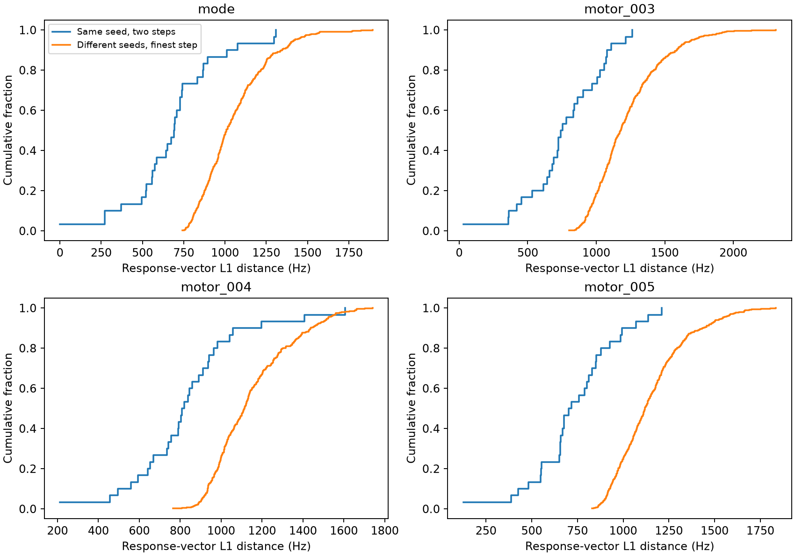
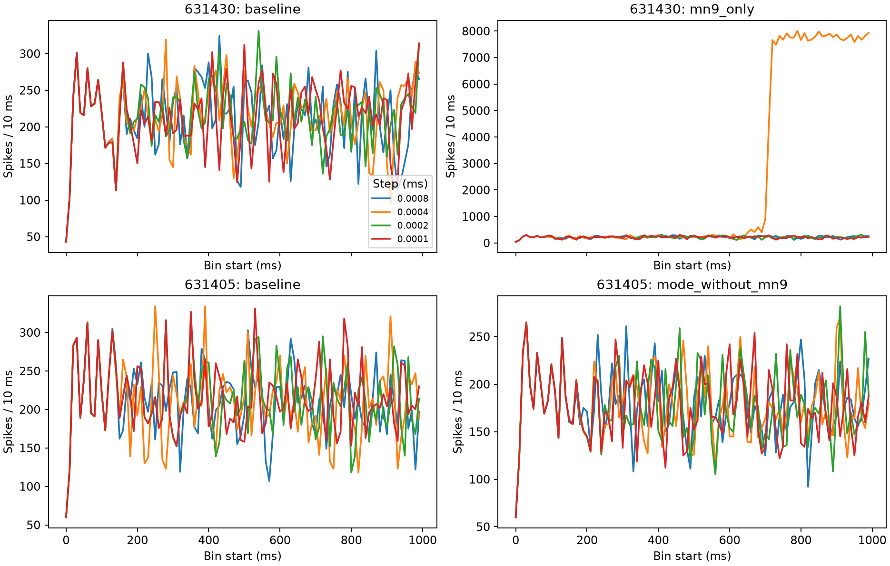

# Follow-up on differences between small time steps

5 October 2026. This analysis was chosen after inspecting the completed fine-step results. It does not replace the frozen agreement criteria or turn their failures into passes. All computation here used downloaded files locally; no new simulation was run.

The selected group's average effect is stable across the tested steps, but individual responses remain meaningfully different. The differences are generally smaller than variation between input seeds, yet are not negligible beside it. The unusually active altered-weight trial has a broad rise in recruitment late in the simulated second. Changed delivered stimulation does not explain that rise.

## What was compared

Read 316 trials: the 300 default-network trials at 0.0002 and 0.0001 ms, plus all 16 altered-weight trials at the four steps. Checked the downloaded archive against the earlier verification hash, matched trial specifications, and checked each consumed spike, rate and delivered-input file against the manifest inside the archive. Reconstructed neuron counts and checked them against saved rates. Exact neuron identifiers were kept as strings. The input to this analysis is the same completed study, not newly sampled trials.

For each default-network seed, calculate lesion minus its paired baseline, then compare that response vector across the two steps. Sum absolute neuronwise differences to obtain an L1 distance, measured in Hz over these one-second runs. For context, calculate the same distance between every distinct pair of seeds at the finest step. There are 30 same-seed step comparisons and 435 different-seed comparisons per lesion condition. The 435 pairs share seeds and are not independent replicates. The conditions also share baselines. No significance test or new acceptance threshold is attached to this comparison.

| Condition | Median same-seed step distance (Hz) | Median different-seed distance (Hz) | Ratio of those medians |
| --- | ---: | ---: | ---: |
| Selected group | 693.5 | 1009.0 | 0.687 |
| motor_003 | 748.0 | 1177.0 | 0.636 |
| motor_004 | 813.5 | 1114.0 | 0.730 |
| motor_005 | 710.0 | 1119.0 | 0.634 |

These are sums across the network, not the change in a typical individual neuron's rate. A ratio below one does not establish that the numerical difference is acceptable. In particular, 63–73% of the between-seed median is substantial. This comparison describes the scale of variation; it does not establish equivalence of response distributions or biological variability across animals.

## When differences become visible

Count spikes per neuron in fixed bins of 1, 5, 10 and 20 ms, and separately compare the population totals. This detects changes in cell participation even when two population totals happen to agree. It does not identify the first microscopic spike-time difference or a causal branching event: two spikes can shift within a bin without changing its count, or cross a bin boundary after a very small timing shift.

For the selected-group lesion, the median first differing neuron-count bin starts at 122.5 ms with 1 ms bins, 302.5 ms with 5 ms bins, and 310 ms with 10 ms bins. The last median excludes one seed with no differing 10 ms neuron-count bin; all 30 have a difference at 1 ms resolution. With 20 ms bins the median is 300 ms, again among 29 seeds. Bin width and bin alignment therefore affect any claim about when divergence begins. We cannot name one onset time from these binned records.

All 150 default-network same-condition/same-seed comparisons have identical delivered input events across the two finest steps, after conversion to a common physical-time grid. Every altered-weight trial likewise has the same delivered events as its finest-step counterpart. These checks exclude changed recorded external delivery as the explanation for these differences. They do not test unrecorded internal voltages or synaptic states.

## Which neurons contribute

For each neuron, average the absolute step difference in the paired response over seeds. This deliberately differs from taking the absolute difference after averaging signed responses, which can hide cancellation. The largest contributors to the selected-group comparison are:

| Root ID | Annotation in the supplied table | Mean absolute difference (Hz) | Inside selected group |
| --- | --- | ---: | --- |
| 720575940630868793 | CB0700, brain motor neuron | 8.900 | Yes |
| 720575940618165019 | CB0700, brain motor neuron | 8.667 | Yes |
| 720575940625874992 | CB0910 | 7.033 | No |
| 720575940629778554 | MNx01, brain motor neuron | 6.500 | No |
| 720575940625045180 | CB0910 | 6.233 | No |

The top ten account for 9.64% of the total selected-group comparison distance. Across the other conditions the top-ten share is 8.49–8.88%. There are 424 neurons with a nonzero contribution in the selected-group comparison and 447–455 in the others. Only 13.49% of the selected-group comparison distance lies inside its 51-cell support. A few cells do not explain away the differences. Overlap among the largest contributors is descriptive; shared baselines and related lesion sets prevent treating it as independent replication of a mechanism.

Annotations are lookups in the supplied file, with its hash recorded. Missing annotations remain missing. Neurotransmitter predictions in that file are not direct measurements of synaptic physiology.

## The altered-weight burst

The case is seed 631430, MN9-only outgoing silencing, weight scale 1.2 and inhibitory scale 0.8. At 0.0004 ms it emits 239568 spikes and recruits 11851 modeled cells over the full second, versus 21401 spikes and 527 cells at 0.0001 ms. These recruitment counts include stimulated inputs. The 0.0008 and 0.0002 ms runs emit 22181 and 21694 spikes. The large response is not monotonic in step size.

The 0.0004 ms lesion trace has 893 spikes in 700–710 ms, 4479 in 710–720 ms, and 7660 in 720–730 ms. The finest-step counts in those bins are 254, 283 and 186. The burst run's maximum is 8007 spikes in 790–800 ms. Activity stays high through the end of the recorded second; the file does not show whether it would later recover.

After seeing this plot, used the following windows to describe recruitment. They are selected after seeing the results and are not biological boundaries or newly declared hypothesis tests. Windows include the start and exclude the end.

| Window (ms) | 0.0004 ms spikes | Cells firing for the first time in this trial | 0.0001 ms spikes | Cells firing for the first time in this trial |
| --- | ---: | ---: | ---: | ---: |
| 0–600 | 13129 | 548 | 13143 | 516 |
| 600–650 | 1045 | 38 | 1042 | 3 |
| 650–700 | 2311 | 542 | 1146 | 1 |
| 700–730 | 13032 | 7081 | 723 | 0 |
| 730–1000 | 210051 | 3642 | 5347 | 7 |

This is widespread recruitment, not just one extremely active neuron: the ten largest positive full-second cellwise spike increases account for about 0.43% of the sum of positive increases. Among cells with increased activity during 650–700 ms are root IDs 720575940612326373, 720575940629377132 and 720575940629393207, each with eight spikes in that window versus zero at the finest step. The latter two have LAL112 annotations; the first lacks a type in the supplied table. These cells are candidates for recording, not established burst initiators. Some were already active well before the rise.

The paired baseline at 0.0004 ms does not show a comparable burst in this second. Neither does the other altered-weight case at any tested step. This narrows the observation to this recorded configuration; it does not establish its frequency across seeds, its anatomical cause, chaos, or a simulator defect.

## Decision about another simulation

A focused diagnostic replay is warranted if we want to explain this burst. Another broad smaller-step sweep is not the useful next experiment. The existing records show spikes and input delivery, but not the voltage or synaptic drive preceding threshold crossings. No analysis of those files can recover the missing state uniquely.

Proposed diagnostic: replay seed 631430 with the same altered weights, MN9-only lesion and original input tape at 0.0004 and 0.0002 ms, from time zero to 750 ms. Use the existing completed trajectories as exact prefix checks. Recording must not change spikes or delivered inputs; if it does, reject the instrumented run before interpreting voltages. Do not initialize at 600 ms without a validated complete state checkpoint, including delayed synaptic events.

Record voltage, synaptic drive and refractory state for MN9 and the ten largest positive 650–700 ms contributors, resolving ties by root ID. Include the 21 input cells for context. Select this list from the saved outputs before any rerun and save it in a new protocol. Record a detailed window from 600–750 ms at the native step, using bounded chunks and scheduled phases documented against the model. Compare threshold margins before spikes and recurrent drive around the rise. This selection may miss the actual initiating cells; if so, expand recording based on explicit evidence rather than claiming the selected cells caused it.

The current model uses linear/exact subthreshold integration and clocked threshold/synaptic operations. Brian2 describes these separately in its [integration documentation](https://brian2.readthedocs.io/en/2.9.0/user/numerical_integration.html) and [scheduling documentation](https://brian2.readthedocs.io/en/2.9.0/user/running.html#scheduling). A diagnostic needs the recorded schedule and state, not an assumption that forward-Euler error caused this result.

The two replays still require substantial computation: the completed one-second workers had median elapsed times of about 3.78 and 7.54 hours at those steps under the prior CCR workload. Scaling to 750 ms gives rough values of 2.84 and 5.65 hours per worker, before new recording overhead; these are estimates, not measured runtimes for the diagnostic. A two-worker CCR job with a measured memory allowance is more appropriate than occupying dozens of cores. The recorder and exact-prefix checks need implementation and local validation before that job is packaged or launched. No new upload or job was created during this analysis.

The default-network result remains reportable as a stable aggregate descriptive effect with unresolved individual numerical agreement and imperfect comparison groups. This diagnostic would address a particular altered-weight failure, not remove those other limitations.

## Evidence and reproducibility

`scripts/pcdr_fine_differences.py` produced `results/pcdr/fine_differences_final_20261005`. It uses sparse bin-by-neuron tables rather than allocating a dense full-network table for every millisecond. It checks its inputs, refuses an occupied output directory and writes completion only after outputs succeed. Eleven focused known-answer/failure tests cover bins, cell identity hidden by equal population totals, empty spikes, invalid values and IDs, distinct seed-pair counting, and phase boundaries. Together with eight checker tests, 19 passed in 0.57 seconds.

Separately checked all 120 default-network response distances against the earlier reconstructed relative distances and their recorded denominators. Contributor sums match mean absolute response distances, and phase spike/recruitment totals match full-trial totals. Checked that a 1e-12-second boundary tolerance changes none of the four burst-case phase assignments. Both figures were visually reviewed. The [compact evidence](evidence/2026-10-05/differences) records hashes, summary tables and figures; full cellwise tables remain in the local result directory.

The initial analysis directory is retained as an earlier pass; the final pass adds phase recruitment and exact archived neuron-table verification. Neither pass overwrites simulation evidence. The sequence and choices are recorded in the lab notebook.
