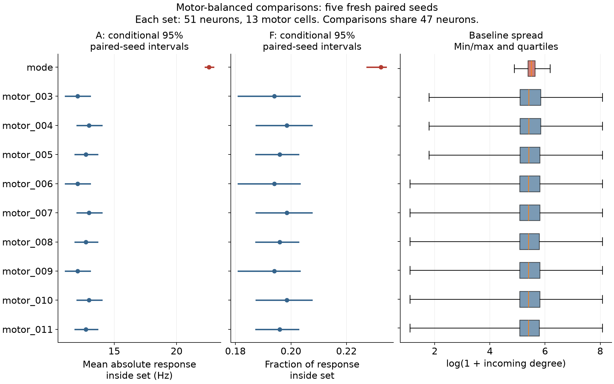

# September eigencircuit study

This directory records the research question, code purposes, decisions and results. The dated notes preserve what was known at each stage; use the newest result page for current conclusions.

The question is whether concentrated eigenvector supports of the signed v630 connectivity matrix predict localized responses to output lesions beyond degree/strength, strong connections and recruitment. P/D/C/R are overlapping explanations. A and F describe simulated rate changes; MN9 firing is not feeding behavior.

## Reading order

1. [Plan and paper notes](PLAN.md): definitions, original procedure and dated amendments.
2. [Code guide](CODE_GUIDE.md): separate explanations of what each part does.
3. [Lab notebook](LAB_NOTEBOOK.md): dates, changes, mistakes, commands and assistance.
4. [Original optimized-comparison pilot](OPTIMIZED_PILOT_RESULTS_20260921.md) and [separate 30-seed replication](SEED_REPLICATION_RESULTS_20260922.md).
5. [Motor-matching feasibility](FULLPOOL_FEASIBILITY_20260922.md): nine valid sets under the original mean-balance rules.
6. [Baseline distribution audit](MOTOR_SET_AUDIT_20260922.md): remaining differences before those sets were simulated.
7. [Motor-composition pilot](MOTOR_COMPOSITION_RESULTS_20260922.md): all ten lesion conditions, five fresh seeds and paired contrasts.

These comparisons are optimized, strongly overlapping and imperfectly balanced in their distributions. Neither more seeds nor more such sets establishes a calibrated random-control test. The original 199-control confirmation and CCR validation remain pending.

The motor-composition pilot completed all 55 trials: the eigen-set had A = 22.604 Hz and F = 0.2324, exceeding all nine comparisons on both. The nine comparison memberships produced only three distinct observed five-seed spike trajectories; substitutions within each repeated group involved cells that were silent in these runs. This is a substantive limit on comparison diversity.

## Evidence and reproduction

[The compact evidence snapshot](evidence/2026-09-22/README.md) includes exact copied records, readable tables and a manifest of source paths and hashes. The full local `results/pcdr` archives include spikes, input tapes, rates, complete footprints and frozen source ZIPs. Those large archives are not duplicated in Git. The compact snapshot alone is not enough to recompute each trial from spikes.

The study ran in Python 3.11.9 with Brian2 2.9.0; [environment-local.txt](environment-local.txt) records the working environment. The root `requirements.txt` pins the older Brian2 2.5.1 environment. Do not call those environments equivalent or silently substitute one during a frozen replay. No equivalence claim is based on the repository unit tests. Input files, signs, source and package hashes are checked by the worker.

Run software checks with `python -m pytest tests -q`. Run `python scripts/pcdr_motor_pilot_report.py` to rebuild the final Markdown report and figure from the compact evidence snapshot after installing its recorded plotting dependencies. `pcdr_publish_evidence.py` creates that snapshot from complete local archives and refuses to overwrite an existing snapshot.

The dated one-off study preparation scripts refuse to overwrite frozen output folders. They often depend on prior local results and are not a sequence to run blindly in a fresh clone. See the code guide and each script's declared inputs before running a study. A new simulation requires a newly recorded design/output directory; it must not overwrite these completed records.

The early `pcdr_fullpool_motor_witness.py` integer attempt exceeded its internal solver time limit. It is retained to reproduce the historical method, not recommended as an unguarded new run. The later `pcdr_bounded_process.py` and `pcdr_fullpool_relaxation.py` add an external deadline. Historical pilot controllers likewise do not replace the newer guarded serial queue.

PDF export uses `pcdr_build_motor_record_pdf.py` with pypdf and reportlab and requires the prior local PDF edition. PDF builders and visual QA output are documentation tools, separate from scientific simulation code. Generated PDF editions are stored locally under `exports/`; they are not required to inspect the Markdown or evidence on GitHub.

Code and documentation were prepared with Codex assistance. Git commits use Copeland Baker's configured author identity; that does not replace the assistance record or imply the notes are a student-authored STS submission.

Latest continuation: [preliminary closeout](PRELIMINARY_CLOSEOUT_20260922.md), [OnDemand notebook guide](CCR_NOTEBOOK_GUIDE.md), and [frozen descriptive follow-up](CCR_SENSITIVITY_DESIGN.json). The 350 follow-up trials are prepared, not run; confirmation remains unresolved.
