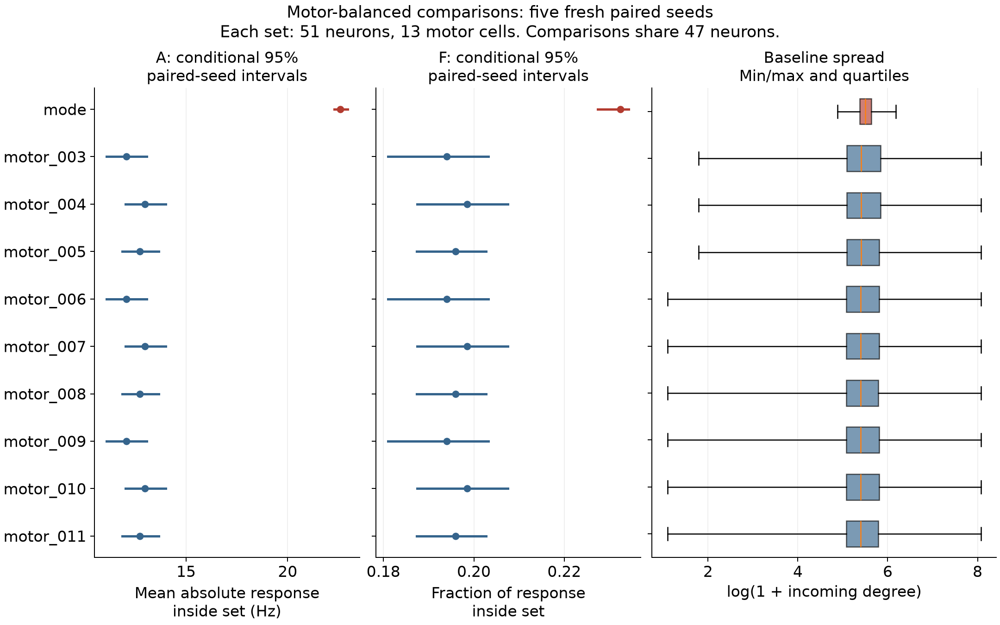

# September eigencircuit study

This directory records the research question, code purposes, decisions and results. The dated notes preserve what was known at each stage; use the newest result page for current conclusions.

The question is whether concentrated eigenvector supports of the signed v630 connectivity matrix predict localized responses to output lesions beyond degree/strength, strong connections and recruitment. P/D/C/R are overlapping explanations. A and F describe simulated rate changes; MN9 firing is not feeding behavior.

## Current starting points

[Adviser meeting brief, 10 October](MEETING_BRIEF_20261010.md): short opening, completed evidence and limits, likely questions, and three decisions needed before more large runs. [Latest exact shared-event check](BASELINE_GATING_20261010.md) finds zero acceptance differences at only 1.54% incoming-event coverage; it cannot exclude shifted-event refractory effects.

[Incoming-history sensitivity, 9 October](HISTORY_PARTS_20261009.md): constructed timing/surplus mixtures change target counts, but 21/26 cases depend on the event-pairing rule and many mixtures violate source refractory spacing. Stop this mixture branch; retain actual-history replay evidence without claiming a unique timing/count attribution.

[Baseline local replays, 9 October](BASELINE_REPLAY_20261009.md): all 112 native target prefixes match saved ticks. Early timing selection changes no short-prefix counts; a recorded count-focused amendment selects 26 seeds. At a fixed fine step, each selected target retains its coarse count under coarse incoming history. This is a conditional local result, not a traced initiating network cause or convergence.

[Baseline differences before the endpoint, 9 October](BASELINE_TIME_20261009.md): count disagreement is substantial by 600–900 ms. A conservative bound leaves at least 97.45% of pooled count L1 after arbitrary deletion of observed spikes in the final 1 ms. This bounds a narrow endpoint explanation; it does not establish convergence or identify the initiating mechanism.

[Baseline count partition, 9 October](BASELINE_COUNTS_20261009.md): 96.43% of final-halving baseline count disagreement occurs in cells active at both steps. Existing timing-code checks were reviewed without repeating them; no new coding discrepancy identified. Count differences cannot be explained solely by moving spikes between internal time bins.

[Baseline/lesion step decomposition, 9 October](STEP_CANCELLATION_20261009.md): baseline cross-step disagreement is substantial; at the final halving its median L1 is 578.5 Hz versus 309.5 Hz for the selected lesion. Paired subtraction cancels about 19% of combined differences. All original convergence failures remain.

[Overnight decision memo, 9 October](OVERNIGHT_DECISION_20261009.md): local replay independently generates resets and matches all twelve target prefixes through their first outside differences. All eighteen convergence groups still fail. Overnight deliverables complete; no new network run proposed for automatic launch.

[Conditional downstream crossings, 9 October](DOWNSTREAM_CROSSINGS_20261009.md): all six endpoint checks pass using observed reset histories; free-running local replay remains pending. [Overnight progress](OVERNIGHT_PROGRESS_20261009.md) records the next bounded check. Convergence remains unestablished.

[Direct routes to first outside changes, 8 October](PATHWAY_ROUTES_20261008.md): all six earliest outside differences have a compatible direct G/H connection; each has exactly one changed incoming presynaptic emission able to arrive beforehand. This localizes the first input difference, not the complete burst mechanism.

[Early G/H divergence, 8 October](PATHWAY_DIVERGENCE_20261008.md): separate removals first change different outside neurons, then share many early changed neurons. Most early event differences preserve per-neuron window counts; the finer non-burst case has more early changed neurons. No common causal mediator is established.

[Reference-cap ablation and amended pairs, 8 October](REFERENCE_ABLATION_20261008.md): all eight fractional diagnostics verified. Dropping old-reference caps permits two fixed-anchor pairs with thirty shared cells, but partner degree-variance ratios reach 9.14–10.43. These unsimulated witnesses answer the weaker amended design only.

[Fixed-anchor alternatives and constraint review, 8 October](ANCHOR_FAMILY_20261008.md): both existing capped anchors fail partner construction under the thirty-cell overlap cap. Independent overlap bounds exceed 31 for each, supporting at least 32 shared cells under the recorded design. General joint feasibility remains unresolved.

[Joint family construction, 8 October](JOINT_FAMILY_20261008.md): the declared two-set search reached its solver limit without an incumbent or reported bound. Feasibility remains unresolved; no retry or simulation was launched.

[Saved comparison-family audit, 8 October](FAMILY_CAPACITY_20261008.md): exhaustive checks of all nineteen candidates show that the existing thirty-cell pairwise overlap cap permits only one set at CDF gap <=11/51; a three-set family requires allowing >=16/51. This is a saved-family limitation, not full-pool infeasibility. No new simulation was launched.

[Distribution-matching continuation, 8 October](DISTRIBUTION_MATCHING_20261008.md): verified searches in nested 538- and 999-cell pools retain an uncapped gap of 8/51; expansion improves the capped gap from 11/51 to 10/51 while worsening incoming-degree variance balance. Candidates remain unsimulated and overlapping. Exact motor strata force at least a 5/51 gap even in the full eligible pool. No CCR simulation was launched.

[Return to the eigencircuit question, 8 October](RESEARCH_CONTINUATION_20261008.md): mode A and F exceed the three fixed comparisons for every seed at every tested fine step. A new baseline-only search found twelve lower-overlap comparison witnesses, independently verified, but within-family overlap and distribution imbalance remain. No new simulations were launched.

[Completed separate G/H experiment, reviewed 8 October](SEPARATE_PATHWAY_RESULTS_20261008.md): all eight trials verified. Either single removal reduces coarser-window recruitment from 7,623 cells to one. Repeated references and joint removals match the prior experiment exactly. The [package instructions](CCR_PATHWAY_RUN.md) are retained for provenance; do not launch a duplicate. Numerical convergence and eigencircuit specificity remain unresolved.

[Completed 600-ms intervention](PATHWAY_RESULTS_20261007.md#second-experiment-removal-at-600-ms): earlier spikes match exactly, while late removal reduces coarser-window spikes to 1,442 and new recruitment to one cell. Both no-change references reproduce fully. Separate-edge contributions and convergence remain unresolved. The completed late-pair upload is retained locally with its dated validation evidence.

[Completed two-connection intervention, reviewed 7 October](PATHWAY_RESULTS_20261007.md): all four trials verified. Removing the pair from time zero reduces late-window spikes from 15,093 to 1,381 at 0.0004 ms, with no new recruitment. At 0.0002 ms the counts are 1,435 and 1,436. Early activity also changes, so a late triggering role is unresolved. This does not establish convergence. The existing [CCR package instructions](CCR_PATHWAY_RUN.md) describe the completed run; no rerun is needed.

[Shared source cells, inputs and resets, 6 October](SOURCE_RESET_CHECKS_20261006.md): 12 reconstructed voltages match recordings across previous resets. A previously identified CRE011 source supplies the largest positive contributions at the four coarser crossings. This explains recorded downstream states, not the initiating divergence or a network intervention.

[Time-zero upstream-input checks, 6 October](UPSTREAM_INPUT_CHECKS_20261006.md): the three newly traced cells' first crossings can be reconstructed from saved inputs before any reset, avoiding an additional recording run. Two shared earlier sources account for most of their positive voltage differences. This is conditional reconstruction of the selected case.

[STS requirements checked on 6 October](STS_REQUIREMENTS_20261006.md): verified dates, report requirements and assistance rules. The working records are not a student-written submission.

[Incoming events and first-spike explanation, 6 October UTC](DIAGNOSTIC_EVENT_RESULTS_20261006.md): recorded arrivals, state updates and resets agree with independent calculations. Two upstream spikes account for most of the positive voltage contribution at one candidate cell's first crossing; the earliest network divergence remains unresolved.

[Returned diagnostic recordings, 5 October](DIAGNOSTIC_RESULTS_20261005.md): both instrumented replays completed and matched the original spike/input prefixes exactly. All recorded output hashes and threshold/spike comparisons passed. The source cells already differ at the start of recording; the initiating cause remains unresolved.

[Burst mechanism review and tested recorder](BURST_MECHANISM_REVIEW_20261005.md): code/literature review, validated recurrent-input reconstruction, exact full-network prefix replays and the next two-run CCR package. Recurrent amplification is supported; the initiating cause remains unresolved.

[Local analysis of remaining differences, 5 October](FINE_DIFFERENCES_20261005.md) compares time-step differences with variation across seeds, identifies contributing cells, and locates broad recruitment in the burst case. Its proposed diagnostic has since completed; see the returned recordings above.

[Completed fine-step results, 5 October](FINE_TIMESTEP_RESULTS_20261005.md): all 620 trials checked locally. Selected-group averages remain similar down to 0.0001 ms, but the declared full agreement criteria fail.

After the meeting: [reflection and finer-step follow-up](MEETING_REFLECTION_20260929.md) records James and Dr. Muldoon’s recommendation, the implementation implications and proposed next work.

[Fine-step implementation and local tests](FINE_TIMESTEP_TESTS_20260929.md) records the new recording approach, event-preservation checks and measured resource costs. The full-duration study has now completed; see the newer result below.

Start with the [short explanation guide](EXPLAINING_THE_STUDY.md) and the [unified experiment overview](RESEARCH_OVERVIEW.md). These separate completed stages, exploratory follow-ups, remaining questions and evidence. The [detailed results](CCR_RESULTS_20260927.md) are current through 29 September. Older entries describe their dates.

The [detailed meeting preparation](MEETING_DETAIL_GUIDE.md) explains the mathematics, choices, candidate evidence and limitations for discussion with James and Dr. Muldoon. It links answers to the underlying records and distinguishes proposed work from completed tests.

## Reading order

1. [Plan and paper notes](PLAN.md): definitions, original procedure and dated amendments.
2. [Code guide](CODE_GUIDE.md): separate explanations of what each part does.
3. [Lab notebook](LAB_NOTEBOOK.md): dates, changes, mistakes, commands and assistance.
4. [Original optimized-comparison pilot](OPTIMIZED_PILOT_RESULTS_20260921.md) and [separate 30-seed replication](SEED_REPLICATION_RESULTS_20260922.md).
5. [Motor-matching feasibility](FULLPOOL_FEASIBILITY_20260922.md): nine valid sets under the original mean-balance rules.
6. [Baseline distribution audit](MOTOR_SET_AUDIT_20260922.md): remaining differences before those sets were simulated.
7. [Motor-composition pilot](MOTOR_COMPOSITION_RESULTS_20260922.md): all ten lesion conditions, five fresh seeds and paired contrasts.

These comparisons are optimized, strongly overlapping and imperfectly balanced in their distributions. Neither more seeds nor more such sets establishes a calibrated random-control test. The original 199-control confirmation remains uncompleted. CCR sensitivity and numerical follow-ups have since completed; see the current overview.

The motor-composition pilot completed all 55 trials: the eigen-set had A = 22.604 Hz and F = 0.2324, exceeding all nine comparisons on both. The nine comparison memberships produced only three distinct observed five-seed spike trajectories; substitutions within each repeated group involved cells that were silent in these runs. This is a substantive limit on comparison diversity.

## Evidence and reproduction

[The compact evidence snapshot](evidence/2026-09-22/README.md) includes exact copied records, readable tables and a manifest of source paths and hashes. The full local `results/pcdr` archives include spikes, input tapes, rates, complete footprints and frozen source ZIPs. Those large archives are not duplicated in Git. The compact snapshot alone is not enough to recompute each trial from spikes.

The study ran in Python 3.11.9 with Brian2 2.9.0; [environment-local.txt](environment-local.txt) records the working environment. The root `requirements.txt` pins the older Brian2 2.5.1 environment. Do not call those environments equivalent or silently substitute one during a frozen replay. No equivalence claim is based on the repository unit tests. Input files, signs, source and package hashes are checked by the worker.

Run software checks with `python -m pytest tests -q`. Run `python scripts/pcdr_motor_pilot_report.py` to rebuild the final Markdown report and figure from the compact evidence snapshot after installing its recorded plotting dependencies. `pcdr_publish_evidence.py` creates that snapshot from complete local archives and refuses to overwrite an existing snapshot.

The dated one-off study preparation scripts refuse to overwrite frozen output folders. They often depend on prior local results and are not a sequence to run blindly in a fresh clone. See the code guide and each script's declared inputs before running a study. A new simulation requires a newly recorded design/output directory; it must not overwrite these completed records.

The early `pcdr_fullpool_motor_witness.py` integer attempt exceeded its internal solver time limit. It is retained to reproduce the historical method, not recommended as an unguarded new run. The later `pcdr_bounded_process.py` and `pcdr_fullpool_relaxation.py` add an external deadline. Historical pilot controllers likewise do not replace the newer guarded serial queue.

PDF export uses `pcdr_build_motor_record_pdf.py` with pypdf and reportlab and requires the prior local PDF edition. PDF builders and visual QA output are documentation tools, separate from scientific simulation code. Generated PDF editions are stored locally under `exports/`; they are not required to inspect the Markdown or evidence on GitHub.

Code and documentation were prepared with Codex assistance. Git commits use Copeland Baker's configured author identity; that does not replace the assistance record or imply the notes are a student-authored STS submission.

## Earlier run instructions

The [initial notebook guide](CCR_NOTEBOOK_GUIDE.md), [expanded guide](CCR_EXPANDED_GUIDE.md) and [fine-step instructions](CCR_FINE_RUN.md) document earlier packages. Their preparation-time statements are historical; use the dated results above for completion status. Do not submit an old package as the next experiment.
